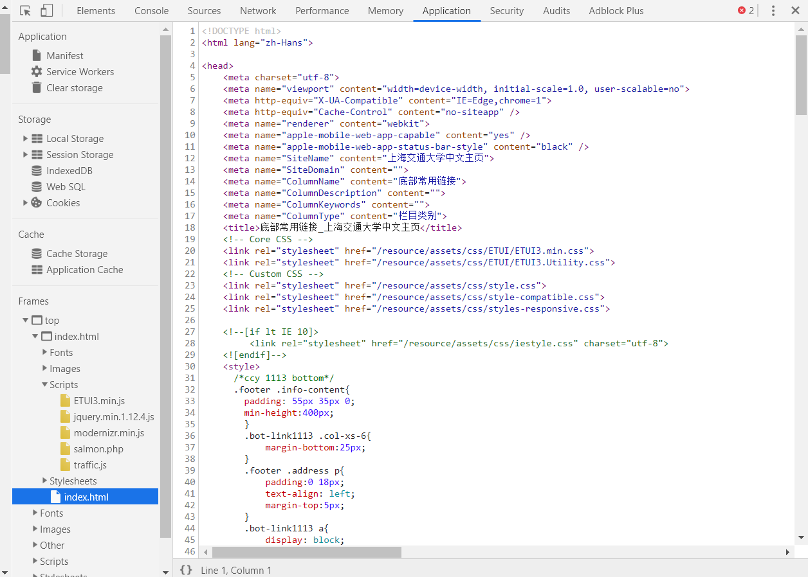

# 用 chrome 开发者工具分析 SJTU 官网

---

## Chrome DevTools

1. Device Mode

这个模式可以模拟移动设备视口，包括：

- 限制网络流量
- 限制 CPU 占用率
- 模拟地理定位
- 设置屏幕方向

下图在这个模式下模拟**iPad pro rotate**下,显示**rules, device frame 和 media queries**的状况，iOS 应用开发者可以在这个模式下调试自己网页在具体设备上的表现。

2. Elements 面板

在这个面板下可以检查和实时编辑页面的 HTML 与 CSS，具体有：

- 实时编辑 DOM 节点
- 实时编辑样式
- 检查和编辑框模型参数
- 查看本地更改

下图使用以上方法，可以对官网界面做出修改,下图将“春夏”改为“秋冬”，大标题颜色改为“blanchedalmond”

3. 控制台面板

在这个面板下调试页面数据，包括：

- 选择执行环境
- 过滤控制台输出
- 清除或保留输出，或者将其保存到文件中

如弹出对话框

4. 源代码面板

在源代码面板中设置断点来调试 JavaScript ，或者通过 Workspaces（工作区）连接本地文件来使用开发者工具的实时编辑器。

- 断点调试
- 调试混淆的代码
- 使用开发者工具的 Workspaces（工作区）进行持久化保存

5. 网络面板

使用网络面板了解请求和下载的资源文件并优化网页加载性能。

- 了解资源时间轴
- 网络带宽限制

6. 性能面板

使用时间轴面板可以通过记录和查看网站生命周期内发生的各种事件来提高页面的运行时性能。

- 分析运行时性能
- 诊断强制的同步布局

7. 内存面板

如果需要比时间轴面板提供的更多信息，可以使用“配置”面板，例如跟踪内存泄漏。

- JavaScript CPU 分析器
- 内存堆区分析器

6. 应用面板

使用安全面板调试混合内容问题，证书问题等等。

7. 安全面板

HTTPS 为您的网站和将个人信息委托给您的网站的人提供了重要的安全性和数据完整性。在 Chrome DevTools 中使用 Security 面板调试安全问题，可以确保已在自己的网站上恰当地实现 HTTPS。

- 使用 Security Overview 可以立即查看当前页面是否安全。
- 检查各个源以查看连接和证书详情（安全源）或找出具体哪些请求未受保护（非安全源）

## 参考

[Chrome 开发者工具](https://developers.google.com/web/tools/chrome-devtools/?hl=zh-cn)

[Learn Chrome DevTools with Screencast Video Tutorials - Egghead](https://egghead.io/browse/tools/chrome-devtools)
