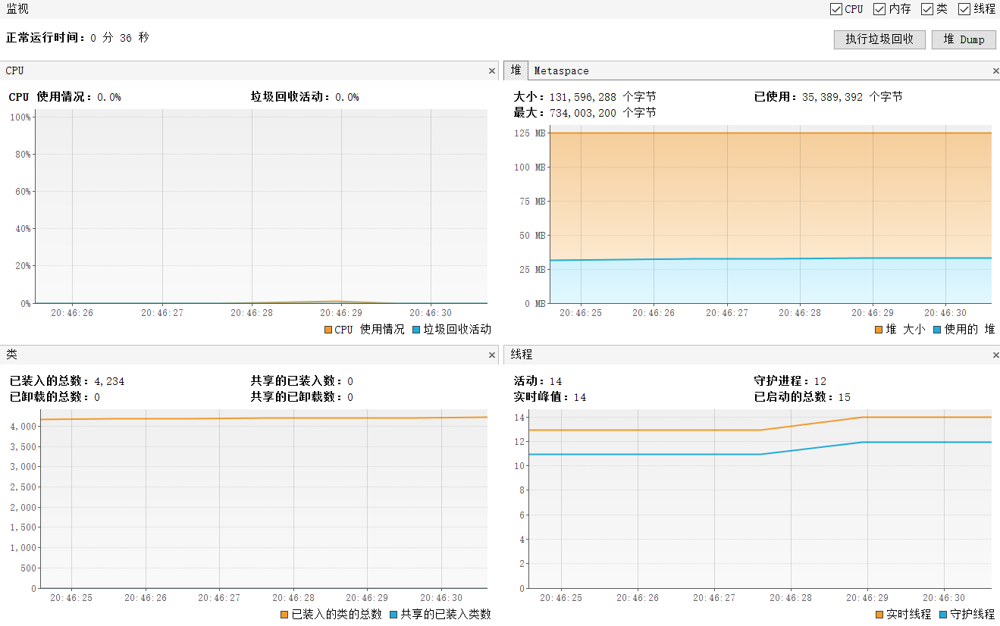

# Word Ladder 资源分析

---

## 启动阶段

- 工具：Java VisualVM

- 应用：分析刚启动程序的 CPU 占用、Java 虚拟机堆的大小、Java 加载类的数量以及应用的线程数

- 运行：

- 结论：启动阶段 cpu 占用低，内存占用资源很大

## 执行阶段

- 工具：jmeter

- 应用：测试有压力的情况下的资源消耗

- 参数设定：

  

_1. login 响应测试_

- 访问：

  

- 测试结果：

  

- 结论：在如图线程组状态下，平均响应时间 3s，处于较慢水平

_2. wordladder 性能测试_

- 访问：
  

- 测试结果：

  

  
  并发访问 1：
  

  并发访问 2：
  

- 结论：cpu 占用偶尔有峰值，内存占用逐渐增加，这是因为我的每次查询都需要重新创建字典数据结构，十分占用资源。

## 总结：

1. 程序接口设计存在问题，应该提供初始化接口和查询两个接口而不是初始化+查询的一个接口，这样会十分消耗资源
2. 当并发数变大之后，应用 cpu 占用在 70%-80%,峰值甚至达到 100%，说明要限制并发数，防止过高占用。
