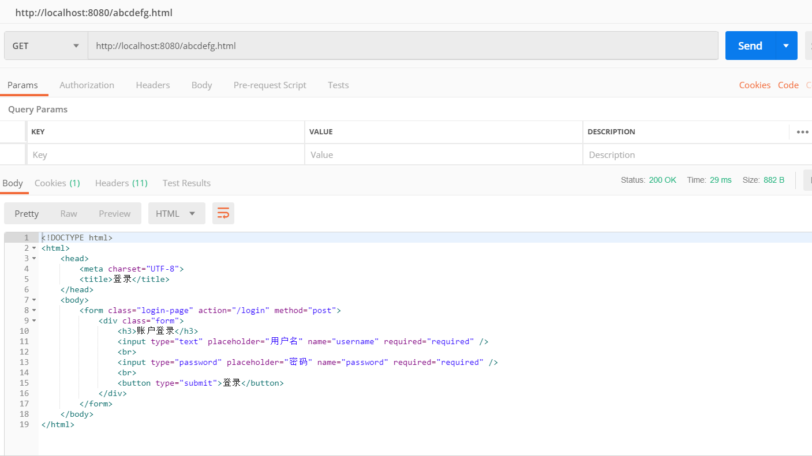

# 应用容器化

---

## Workflow

1. 使用 Dockerfile 定制镜像

- 打包应用:

```js
mvn package
```

- 创建 Dockfile:

```js
FROM openjdk:8
EXPOSE 8080
COPY ./wordladder-0.0.1-SNAPSHOT.jar /home/wordladder.jar
ENTRYPOINT [ "java", "-jar", "/home/wordladder.jar" ]
```

FROM:指定基础镜像
EXPOSE:声明运行时容器提供服务端口
ENTRYPOINT:指定容器启动程序及参数

- 构建镜像:

```js
dockerbuild-tspring-boot-word-ladder: v1.0 .
```

2. 根据镜像实例化成容器

```js
docker run -d -p 8080:8080 --name word-ladder spring-boot-word-ladder:v1.0
```

-d 指定容器在后台运行
--name 容器命名
-p 宿主机端口映射到容器端口

3. 使用应用<br>



## Docker Hub

[Account](https://hub.docker.com/r/yuanzhuo/spring-boot-word-ladder)

1. 新建的 repo

```css
repo: yuanzhuo/spring-boot-word-ladder;
```

2. 上传

```js
docker tag spring-boot-word-ladder:v1.0 yuanzhuo/spring-boot-word-ladder:v1.0
docker push yuanzhuo/spring-boot-word-ladder:v1.0
```

3. 拉取镜像启动

```js
docker run -d -p 8080:8080 --name wordladder yuanzhuo/spring-boot-word-ladder:v1.0
```

## reference

docker command:

[Docker — 从入门到实践](https://yeasy.gitbooks.io/docker_practice/)
