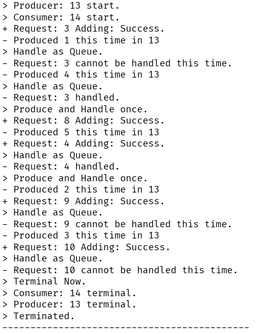
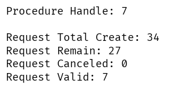
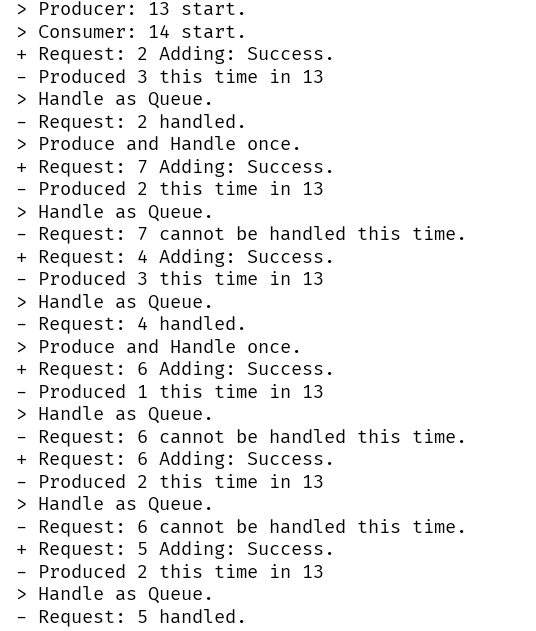
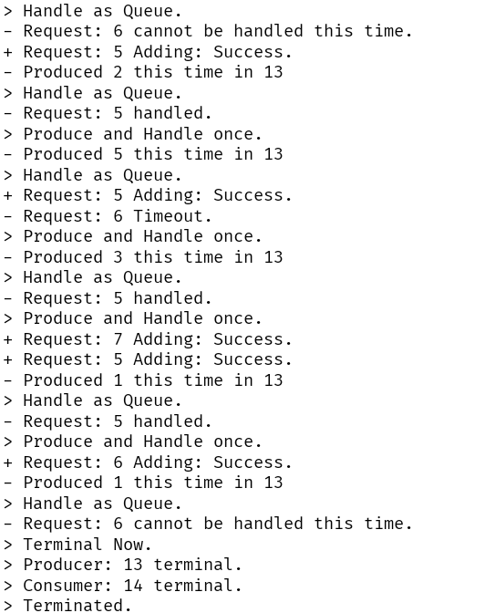

# Java 多线程

---

### 项目逻辑

1. Request：模拟请求对象

```java
private Integer num;
private Long time;
```

2. Consumer:模拟用户

- 生成请求，加入请求队列

```java
while (true) {
    /*
        *  Add Request Here.
        *  Timeout check: cancel request if timeout.
        * */
    Request req = new Request();
    if (this.reqDeque.offerLast(req, timeout, TimeUnit.MILLISECONDS)) {
        System.out.println("+ Request: " + req.getNum() + " Adding: Success.");
        this.reqCnt.updateAndGet(x -> (x + req.getNum()));
    } else {
        System.out.println("+ Request Adding: " + req.getNum() + " Timeout.");
    }
    Thread.sleep(1000);
}
```

3. Producer:模拟服务器

- 生产资源

```java
private int produce_resource() {
    Random resource = new Random();
    int curproCnt = resource.nextInt(5) + 1;
    this.proCnt.updateAndGet(x -> (x + curproCnt));
    this.proTotCnt.updateAndGet(x -> (x + curproCnt));
    return curproCnt;
}
```

- 处理请求

```java
private void handleRequest(Request request) {
    if (request.getNum() <= this.proCnt.get()) {
        /*
            * Timeout Check: ignore request if timeout.
            * */
        if (request.getTime() + timeout < System.currentTimeMillis()) {
            this.reqCanceledCnt.updateAndGet(x -> (x + request.getNum()));
            this.failCnt.incrementAndGet();
            System.out.println("- Request: " + request.getNum() + " Timeout.");
        } else {
            this.proHandleCnt.updateAndGet(x -> (x + request.getNum()));
            this.proCnt.updateAndGet(x -> (x - request.getNum()));
            this.successCnt.incrementAndGet();
            System.out.println("- Request: " + request.getNum() + " handled.");
            }

        this.reqDeque.remove(request);

        System.out.println("> Produce and Handle once.");
    } else {
        System.out.println("- Request: " + request.getNum() + " cannot be handled this time.");
    }
}
```

- 动态调控

```java
while (true) {
    /*
        * produce resource
        * */
    Integer curproCnt = produce_resource();
    System.out.println("- Produced " + curproCnt + " this time in " + Thread.currentThread().getId());

    /*
        *  consume resource
        * */
    if (this.reqDeque.size() < 10) {
        System.out.println("> Handle as Queue.");
        try {
            Request request = this.reqDeque.getLast();
            handleRequest(request);
        } catch (NoSuchElementException e) {
            System.out.println("> No Request Now.");

        }
    } else {
        System.out.println("> Handle as Stack.");
        try {
            Request request = this.reqDeque.getFirst();
            handleRequest(request);
        } catch (NoSuchElementException e) {
            System.out.println("> Transfer to queue.");
        }
    }
    Thread.sleep(1000);
}
```

4. MulApp：模拟运行过程

- 根据指定设置条件

```java
for (int i = 0; i < proNum; ++i) {
    theProceduerList.add(new Producer(reqDeque, proCnt, proTotCnt,proHandleCnt, reqCanceledCnt, timeout));
}

for (int i = 0; i < conNum; ++i) {
    theConsumerList.add(new Consumer(reqDeque, reqCnt, timeout));
}
```

- 模拟运行

```java
ExecutorService service = Executors.newCachedThreadPool();

for (int i = 0; i < proNum; ++i) {
    service.execute(theProceduerList.get(i));
}

for (int i = 0; i < conNum; ++i) {
    service.execute(theConsumerList.get(i));
}
```

- 分析结果

```java
reqValid = reqCnt.get() - reqCanceledCnt.get() - reqRemain(reqDeque);

System.out.println("Procedure Handle: " + proHandleCnt.get());

System.out.println();

System.out.println("Request Total Create: " + reqCnt);
System.out.println("Request Remain: " + reqRemain(reqDeque));
System.out.println("Request Canceled: " + reqCanceledCnt);
System.out.println("Request Valid: " + reqValid);
```

### 运行分析

1. 一对一

- 运行过程
  

- 结果
  

1. 三对三

- 运行过程
  
  

- 结果
  
